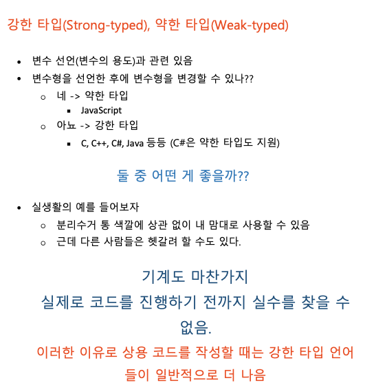
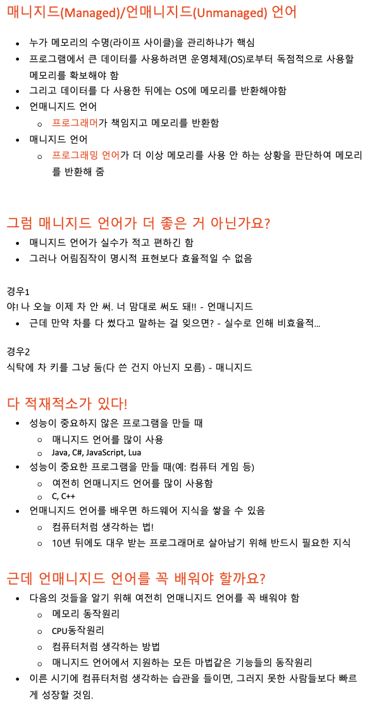
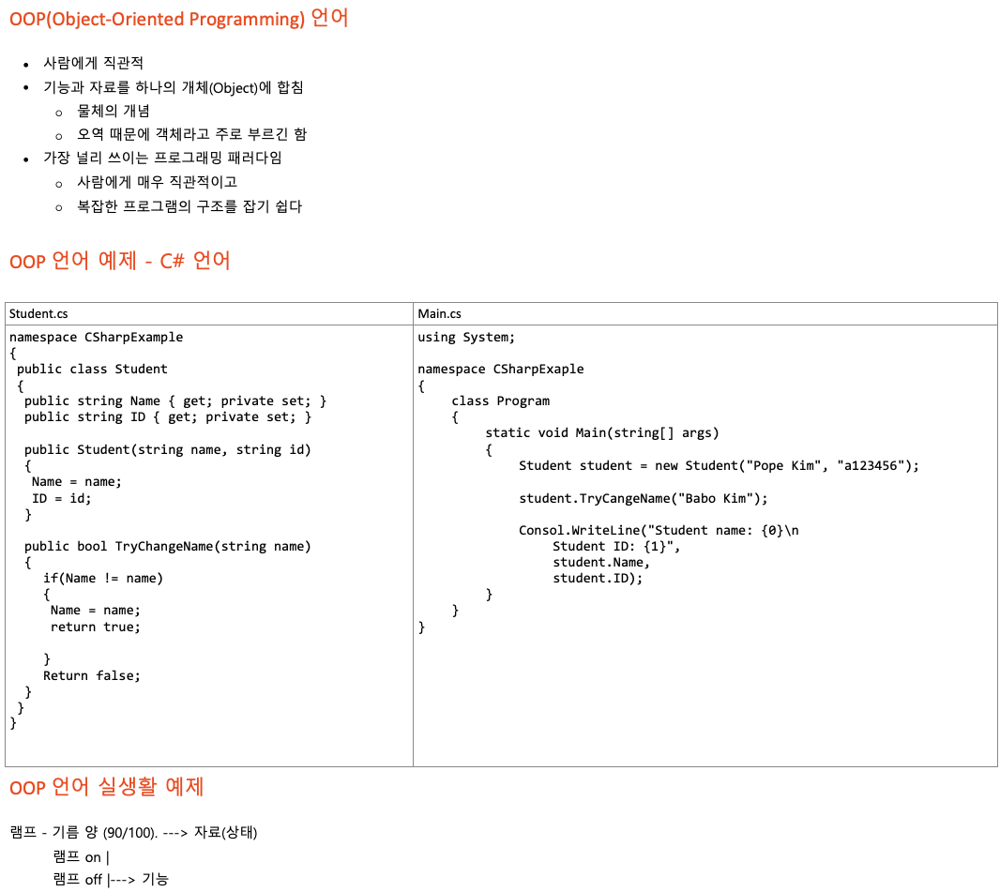

## Section 2 프로그래밍 언어의 분류

### 11. Hello World

```cs
using System;

class Program11 {
  public static void Main (string[] args) {
    Console.WriteLine("Hello World!");
  }
}
```

```console
Hello World!
```
- 환경세팅을 하고 헬로 월드를 찍어 봅니다.
- 저의 경우 웹 ide 를 사용하고 있어서 replit 기준으로 코드를 적어서 namespace가 없는데, 나중에 배우다 보면 더 잘쓸 수 있겠죠?


### 12. 프로그래밍 언어 분류

- 프로그래밍 언어의 분류를 알아야 한다.
- 지루하지만 중요한 내용이다.
- 실무 시에 어떤 언어가 개발이 빠른지, 실행 속도가 빠른지 알아야하기 때문이다.


### 13. 저수준 언어 vs 고수준 언어

- 저수준 언어(Low-level language)
  - 컴퓨터가 이해하기 쉬운 언어
  - 0과 1로만 이루어짐
  - 기계어(Machine code)
  - 컴퓨터가 바로 이해하므로 변환 과정이 필요 없음
- 고수준 언어(high-level language)
  - 인간이 이해하기 쉬운 언어
  - 인간이 사용하는 언어로 이루어짐
    - ex) for, while, if
  - 어셈블리어, C, C++, Java, C#
  - 컴퓨터가 이해하는 기계어로 변환하는 과정이 필요


> - 컴퓨터가 이해하기 쉬운 언어에 가까울수록 저수준
> - 인간이 이해하기 쉬운 언어에 가까울수록 고수준
> - 저수준 언어, 고수준 언어의 정의는 상대적

> 컴퓨터가 이해하는 것
> - 기계어
>   - 혹은 네이티브 코드(Native code)라고도 함
>   - 수학의 2진수
>   - 0과 1
>   - "원조" 저수준 언어
>   - 모든 프로그래밍 언어는 기계어로 번역되어야함
>      - 안그러면 컴퓨터가 이해하지 못함

> 0 1 로만 컴퓨터와 대화하기 쉽지 않아서 사람에게 보다 친근한 방법이 나왔는데
> 그것이 바로 어셈블리어(Assembly Language)이다.

```asm

MOV R1, 3 ;3을 R1에 저장
MOV R2, 4 ;4를 R2에 저장
ADD R1, R2 ;R1과 R2의 값을 더한 후 그 결과를 R1에 저장
MUL R1, R2 ;R1과 R2의 값을 곱한 후 그 결과를 R1에 저장

```
어셈블리어(Assembly Language)
- 사람이 읽기에 조금 더 편한 언어
- 엄밀히 말하면 고수준 언어
- 대부분 기계어랑 일대일 대응
  - ex) MOV는 10, ADD는 20, MUL은 30
  - 이 때문에 보통 저수준 언어라고 함

| 인간어| 어셈블리어 | 기계어(16진수)  |
| - | - |- |
| 3과 4를 더한다 | MOV R1, 3 <br /> MOV R2, 4 <br />  ADD R1, R2 | 0A0103 <br />0A0204 <br />140102|
| 3과 4를 곱한다 | MOV R1, 3 <br /> MOV R2, 4 <br />  MUL R1, R2  |0A0103 <br />0A0204 <br />1E0102|

기계어로 쓰는 것보단 낫지만 어셈블리도 여전히 사람에게는 불편함   
그래서 사람에게 더욱 더 친근한 방법이 나옴   
고수준 프로그래밍 언어(High-level Programming Language)

```cs
int addResult = 3 + 4; // 3과 4를 더한 후 addResult에 저장한다
int mulResult = 3 * 4; // 3과 4를 곱한 후 mulResult에 저장한다

```

고수준 프로그래밍 언어
- 사람이 쓰는 말에 매우 가까워짐(영어)
- 어셈블리어처럼 기계어와 일대일 대응이 불가능
- C, C++, Java, C#, JavaScript 등등
- 메모리를 누가 관리하냐에 따라 매니지드 언어, 언매니지드 언어로 나뉨
- 언매니지드 언어를 저수준 언어라 생각하는 사람들도 있음
  - 저수준 언어가 뭔지 정확하게 모르기 때문이다.


### 14. 컴파일 언어 vs 인터프리터 언어

#### 컴파일 언어(Compiled Language)
> 소스코드(source code) -> 컴파일러(compiler) -> 기계어 -> 실행

ex) exe 실행파일 - 기계어
- C, C++ ; 운영체제, 머신러닝 최적화에 쓰임
- 오프라인 컴파일러가 고수준 언어를 네이티브 코드로 컴파일
- 다양한 최적화가 가능
  - 1시간 동안 컴파일, 0.1초 만에 실행
  - 근데 코드 한 줄 바꾸고 1시간 컴파일하는 둥의 개발 도중 문제가 생길 가능성이 있다.
  - Cpu 또는 운영체제 별로 기계어가 다르다, 컴파일을 다르게 해야함
- 플랫폼(MacOS, 32bit Window, IphoneOS) 마다 다른 exe파일을 컴파일 해야함

#### JIT(Just-In-Time)컴파일 언어
> 소스코드 -> 컴파일러 -> 중간언어코드(intermediate language code) exe -> JIT Compiler( 가상머신) -> 기계어 -> 실행
- C#, Java, WASM(WebAssembly)
- 오프라인 컴파일러가 소스 코드를 중간 언어로 컴파일
- 플랫폼 별로 VM(Virtual Machine, 가상머신)을 설치해야 함
- 프로그램 실행 중에 VM이 중간 언어를 기계가 이해하는 언어로 바꿔서 실행
- JAVA나 C#은 플랫폼에 종속적이지 않고 VM에 종속적임

#### 인터프리터 언어(Interpreter Language)
> 소스코드 -> 인터프리터 -> 기계어 -> 실행

소스코드를 바로바로 기계어로 통역하는 경우도 있고   
소스코드를 이미 만들어진 기계어 함수에 대응시켜서 실행하는 것일 수도 있다.   
보통 후자의 경우를 많이 사용한다.

- javascript, Python. Lua, PHP
- 실행 중에 고수준 언어를 네이티브 코드로 바꿔서 실행함
- 실제로 실행하기 전까지 코드의 문제를 잡아낼 수 없음
  - 오프라인 컴파일러가 없어서.
  - 실행하기 전에 본인이 만든 실수를 바로잡을 수 없다.
  - 컴파일 언어와 이런 부분에서 다르다.

### 15. 강한 타입 언어, 약한 타입 언어


강한 타입(Strong-typed), 약한 타입(Weak-typed)

	• 변수 선언(변수의 용도)과 관련 있음
	• 변수형을 선언한 후에 변수형을 변경할 수 있나??
		○ 네 -> 약한 타입
			§ JavaScript
		○ 아뇨 -> 강한 타입
			§ C, C++, C#, Java 등등 (C#은 약한 타입도 지원)

둘 중 어떤 게 좋을까??

	• 실생활의 예를 들어보자
		○ 분리수거 통 색깔에 상관 없이 내 맘대로 사용할 수 있음
		○ 근데 다른 사람들은 헷갈려 할 수도 있다.

	기계도 마찬가지
	실제로 코드를 진행하기 전까지 실수를 찾을 수 없음.
	이러한 이유로 상용 코드를 작성할 때는 강한 타입 언어들이 일반적으로 더 나음


### 16. 매니지드 언어, 언매니지드 언어

매니지드(Managed)/언매니지드(Unmanaged) 언어

	• 누가 메모리의 수명(라이프 사이클)을 관리하냐가 핵심
	• 프로그램에서 큰 데이터를 사용하려면 운영체제(OS)로부터 독점적으로 사용할 메모리를 확보해야 함
	• 그리고 데이터를 다 사용한 뒤에는 OS에 메모리를 반환해야함
	• 언매니지드 언어
		○ 프로그래머가 책임지고 메모리를 반환함
	• 매니지드 언어
		○ 프로그래밍 언어가 더 이상 메모리를 사용 안 하는 상황을 판단하여 메모리를 반환해 줌


그럼 매니지드 언어가 더 좋은 거 아닌가요?   

	• 매니지드 언어가 실수가 적고 편하긴 함   
	• 그러나 어림짐작이 명시적 표현보다 효율적일 수 없음   

경우1   
야! 나 오늘 이제 차 안 써. 너 맘대로 써도 돼!! - 언매니지드

	• 근데 만약 차를 다 썼다고 말하는 걸 잊으면? - 실수로 인해 비효율적...

경우2   
식탁에 차 키를 그냥 둠(다 쓴 건지 아닌지 모름) - 매니지드

다 적재적소가 있다!   

	• 성능이 중요하지 않은 프로그램을 만들 때   
		○ 매니지드 언어를 많이 사용
		○ Java, C#, JavaScript, Lua
	• 성능이 중요한 프로그램을 만들 때(예: 컴퓨터 게임 등)
		○ 여전히 언매니지드 언어를 많이 사용함
		○ C, C++
	• 언매니지드 언어를 배우면 하드웨어 지식을 쌓을 수 있음
		○ 컴퓨터처럼 생각하는 법!
		○ 10년 뒤에도 대우 받는 프로그래머로 살아남기 위해 반드시 필요한 지식

근데 언매니지드 언어를 꼭 배워야 할까요?

	• 다음의 것들을 알기 위해 여전히 언매니지드 언어를 꼭 배워야 함
		○ 메모리 동작원리
		○ CPU동작원리
		○ 컴퓨터처럼 생각하는 방법
		○ 매니지드 언어에서 지원하는 모든 마법같은 기능들의 동작원리
	• 이른 시기에 컴퓨터처럼 생각하는 습관을 들이면, 그러지 못한 사람들보다 빠르게 성장할 것임.


### 17. 프로그래밍 패러다임: 절차지향 언어

절차적(Procedural) 언어

	• 가장 단순한 형태의 언어
	• 함수를 실행하면 결과가 바로 반환 됨
	• 그 결과를 저장하고 싶으면 별도의 공간에 보관
	• 기능과 자료저장의 분리
	• 절차에 주목하라. 컴퓨터 프로그램은 순서대로 호출하면 결과가 나온다. 절차에 따라 코드를 실행한다. 실행에 따라 뒤의 것에 실행에 영향을 줄 수 있는데, 이를 상태라고 함. 상태(자료)는 어디에 저장하는가? 이는 별도의 공간에 보관 됨. 그래서 기능과 자료저장은 분리가 됨.


절차적 언어 실생활 예제

경리: 김사장님 오늘 10원의 지출이 있었습니다.   
<2019년 1월 2일 엑셀파일>   
|원금|	수입|	지출|	총액  |
|-|-|-|-|
|1000|	0|	10|	990| 

경리: 김사장님 오늘은 2000원의 수입과 900원의 지출이 있었습니다.   
<2019년 1월 3일 엑셀파일>   
|원금|	수입|	지출|	총액  |
|-|-|-|-|
|990|	2000|	900|	2090|   

계산은 계산기에서!  
결과는 어딘가에 적어 두기!   
1월 3일의 엑셀 파일에서는 1월 2일에 어땠는지 나와있지 않다.   
같은 엑셀 파일의 같은 줄을 계속 업데이트 하는 상황(덮어쓰기)   
즉, 상태가 변할 수 있음  


### 18.프로그래밍 패러다임: OOP(Object-Oriented Programming)언어



```cs

namespace CSharpExaple
{
public class Student
  {
    public string Name {get; private set;}
    public string ID {get; private set;}

    public Student(string name, string id)
    {
      Name = name;
      ID = id;
    }

    public bool TryChangeName(string name)
    {
      if(Name != name){
        Name = name;
        return true;
      }
      return false;
    }
  }
}
```

```cs
using System;
namespace CSharpExaple
{
  class Program18{
    
    static void Main(string[] args){
      Student student = new Student("junho baek", "2020122060");
      student.TryChangeName("junjunjun");
      
      Console.WriteLine("Student name: {0}\n Student ID: {1}", student.Name, student.ID);
    }
  }
}

```

- 프로젝트 폴더 내에 네임스페이스를 이용할 때는 csproj 파일을 이렇게 해줘야 작동하더라
```csproj
<Project Sdk="Microsoft.NET.Sdk">

  <PropertyGroup>
    <OutputType>Exe</OutputType>
    <TargetFramework>netcoreapp6.0</TargetFramework>
  </PropertyGroup>

</Project>

```


### 19. 프로그래밍 패러다임: 함수형(Functional) 언어


### 20. C#은 어떤 언어인가요?
	• 강한 타입언어
	• 매니지드 언어
	• OOP
		○ 그러나 이 강의에서는 프로그래밍 입문에만 집중하기 위해 주로 절차적 언어처럼 사용할 것임
		○ 절차적 언어는 OOP를 배우기 전에 알아야할 기본 지식!
		○ 중간 이후에 OOP를 간략하게나마 알아볼 예정
그러나 '개체지향 프로그래밍 및 설계' 과목에서 제대로 배움.

### 21. 정리
정리

	• 고수준 언어, 저수준 언어
	• 컴파일 언어, JIT 컴파일 언어, 인터프리터 언어
	• 강한 타입 언어, 약한 타입 언어
	• 매니지드 언어, 언매니지드 언어
	• 프로그래밍 패러다임 	절차 	oop	함수


