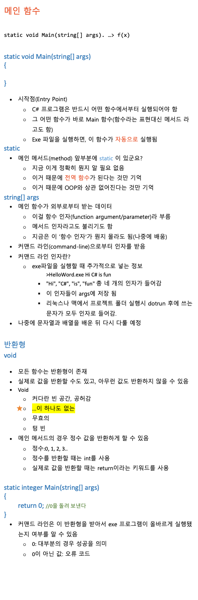
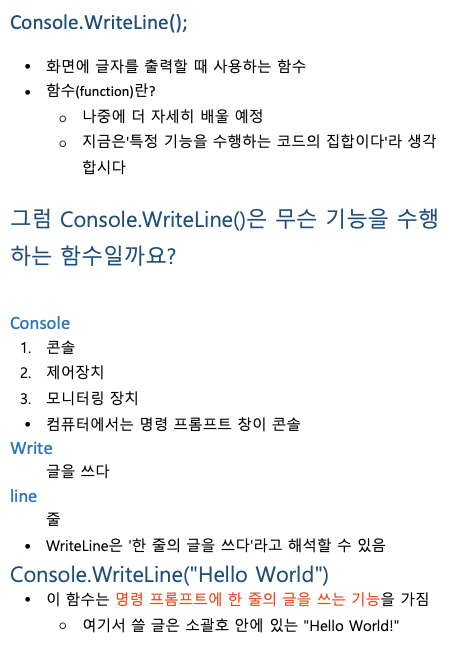
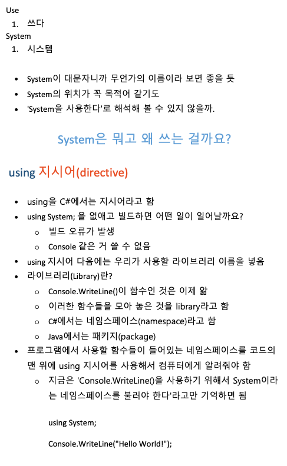
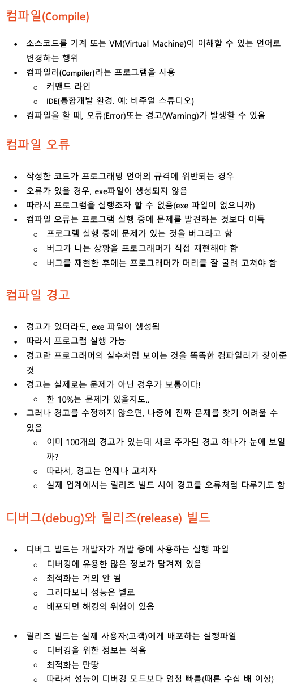
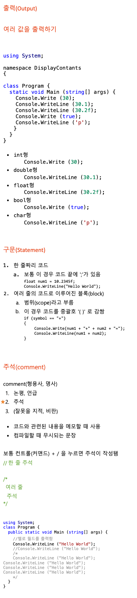
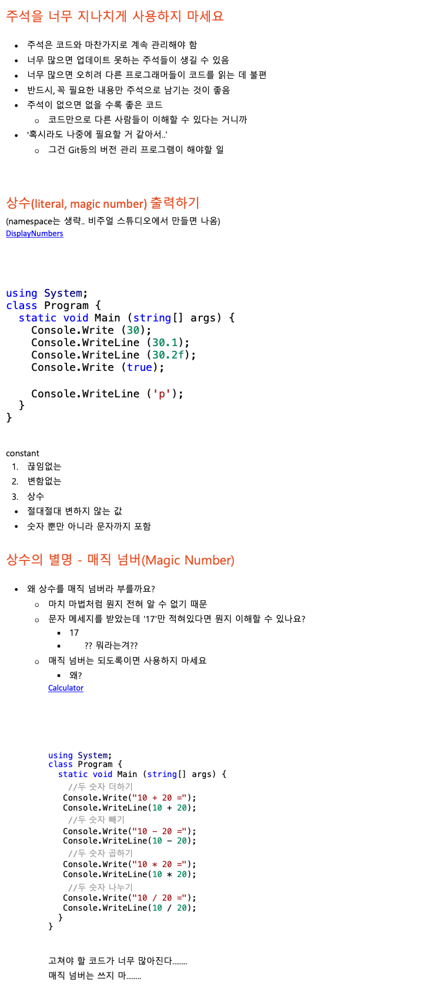

## Section3 출력(Output), 상수(Constant)

### 22. 다시 만나는 Hello World

```cs
using System;

namespace HelloWorld
{
    class Program
    {
        static void Main(string[] args)
        {
            Console.WriteLine("Hello World!");
        }
    }
}
```

### 23.메인 함수란?



### 24. Console.WriteLine();



### 25. Using System;

> 라이브러리나, 패키지나, 네임스페이스는 거의 비슷한 것이다!!!!



## 26.컴파일(Compile)이란?



## 27.여러 값을 출력하기


```cs
using System;
namespace DisplayContants{
  class Program{
    static void Main (String[] args){
      Console.Write(30); //int 형
      Console.WriteLine(30.1); //double
      Console.WriteLine(30.2f);// float
      Console.Write(true); // boolean
      Console.WriteLine('p'); // char
    }
  }
}

```

### 29. 상수
```cs
using System;
namespace DisplayNumbers
{class Program {
  static void Main (string[] args) {
    Console.Write (30);

    Console.WriteLine (30.1);

    Console.WriteLine (30.2f);

    Console.Write (true);
    
    Console.WriteLine ('p');
  }
}}
```

```cs
using System;
namespace Calculator
{class Program {
  static void Main (string[] args) {
    //두 숫자 더하기
   Console.Write("10 + 20 =");
   Console.WriteLine(10 + 20);

    //두 숫자 빼기
   Console.Write("10 - 20 =");
   Console.WriteLine(10 - 20);

    //두 숫자 곱하기
   Console.Write("10 * 20 =");
   Console.WriteLine(10 * 20);

    //두 숫자 나누기
   Console.Write("10 / 20 =");
   Console.WriteLine(10 / 20);   
  }
}}
```

